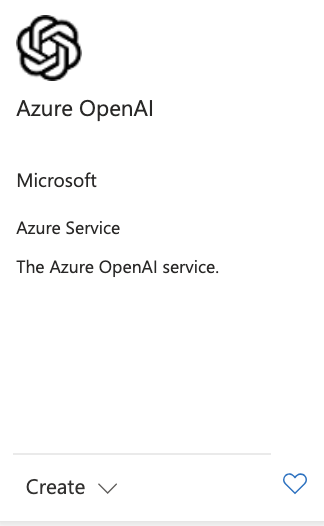
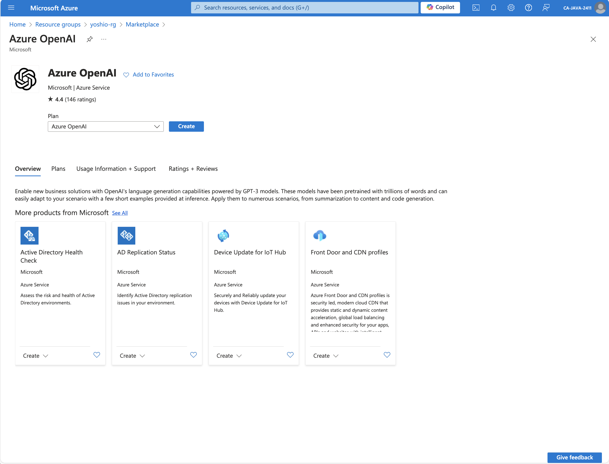
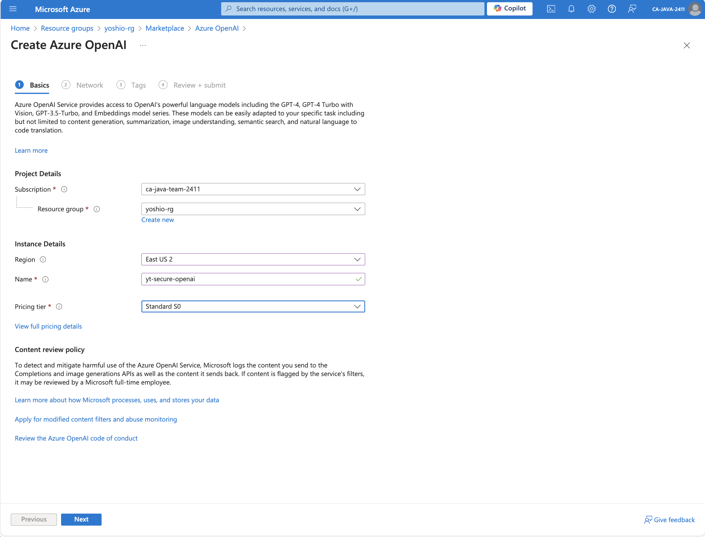
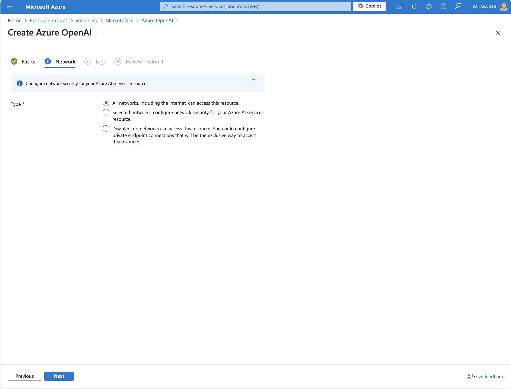
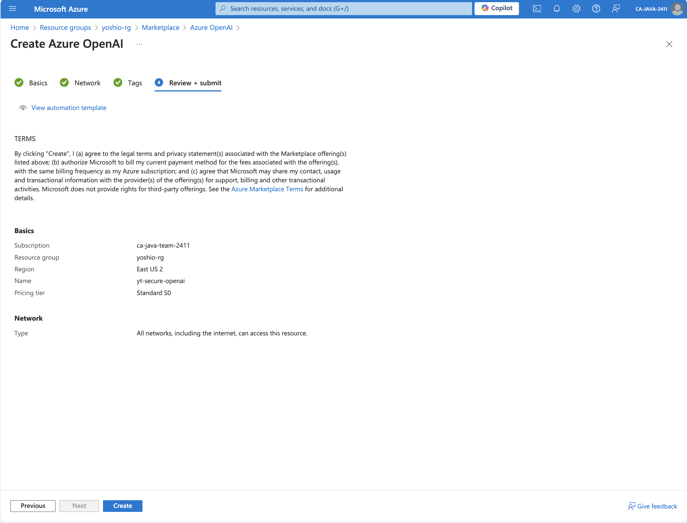
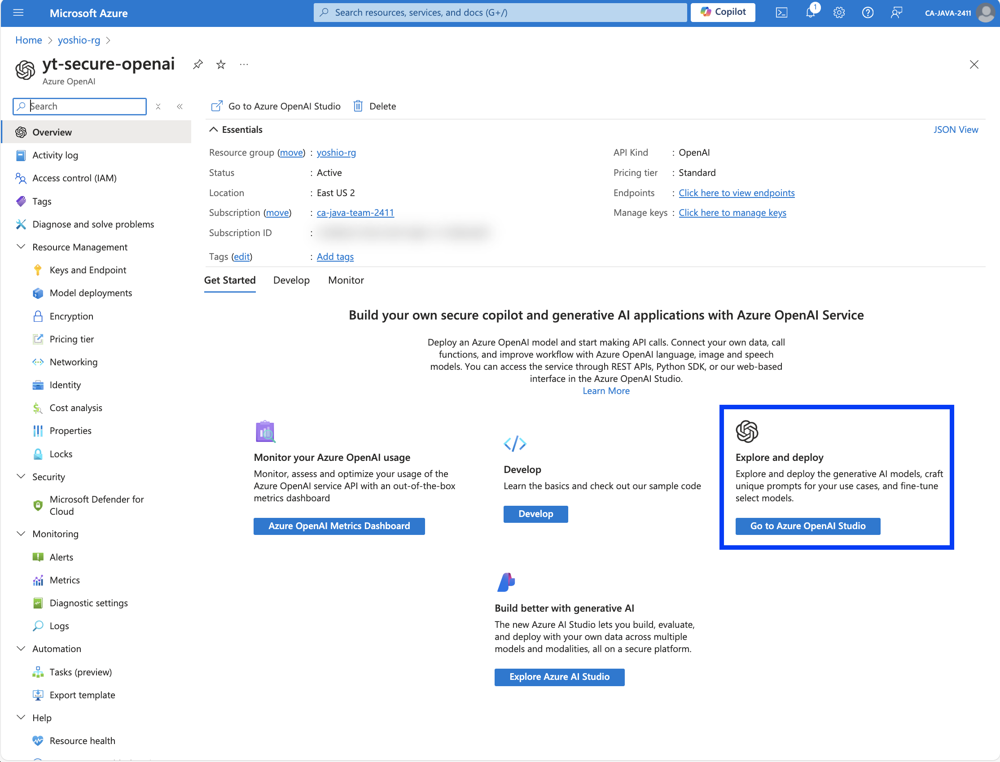
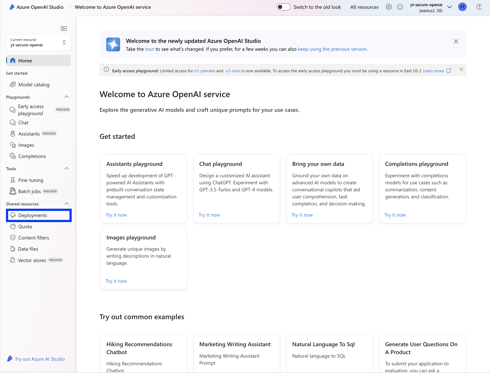
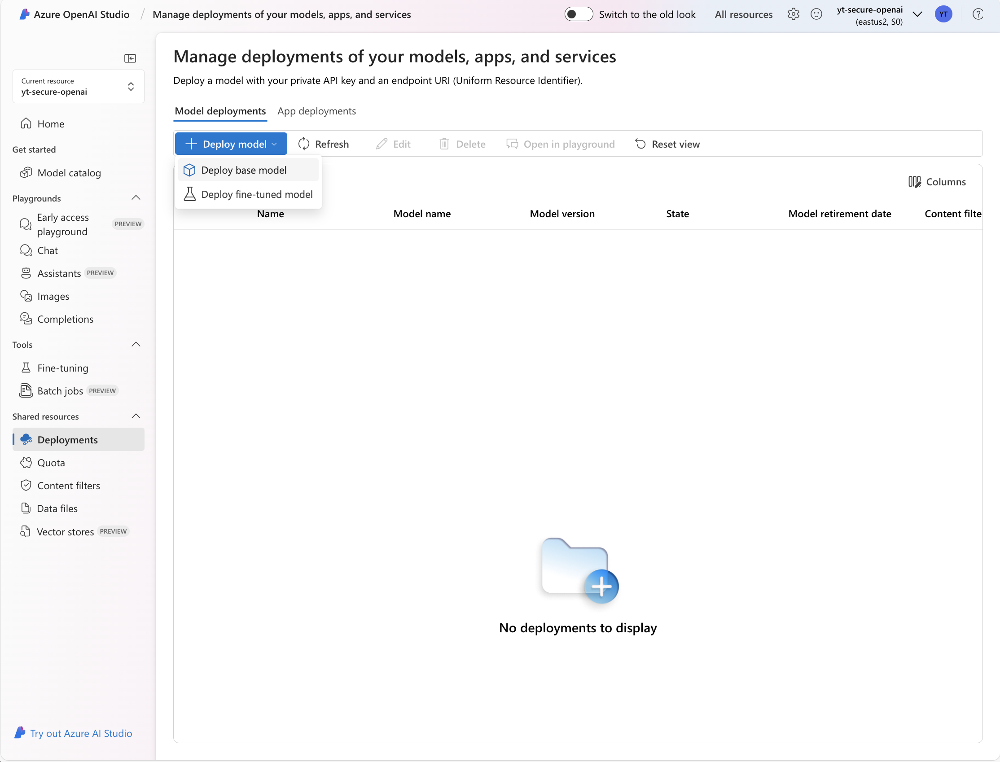
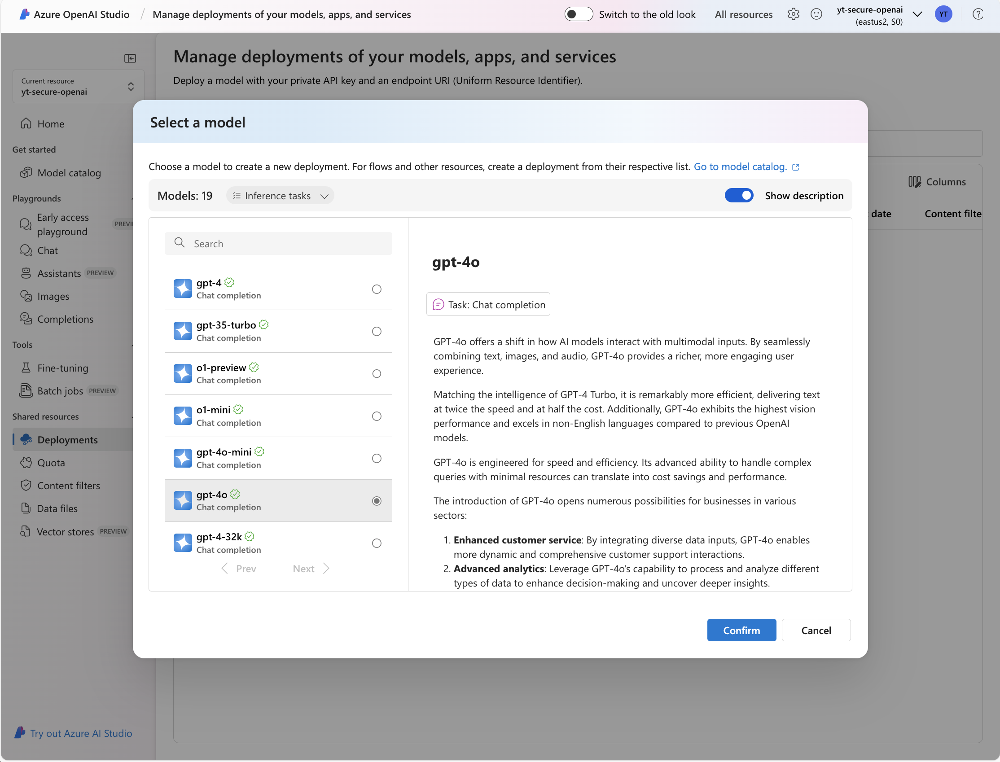
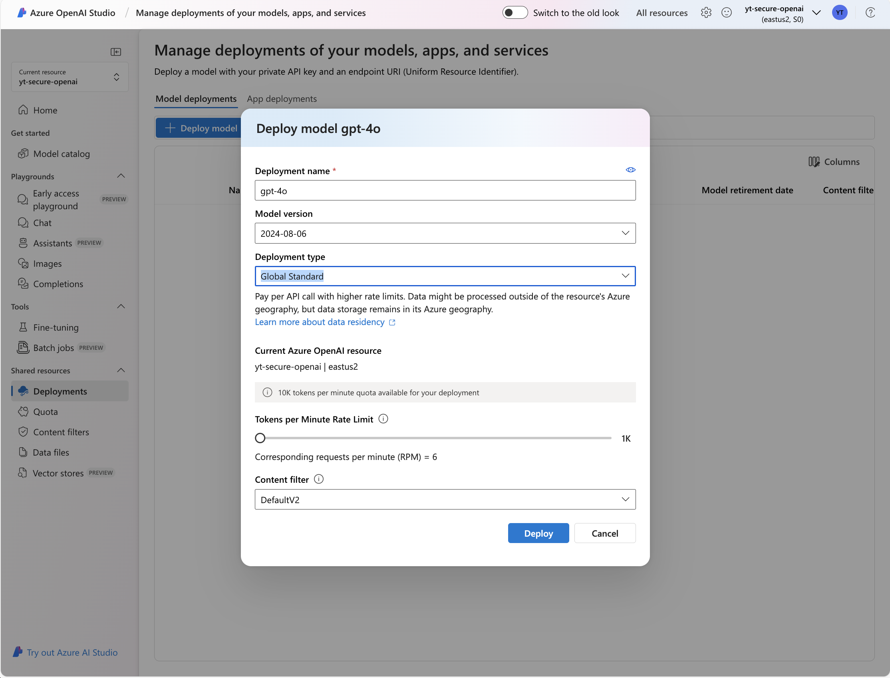

# Securely Connecting Azure Container Apps to Azure OpenAI using User Managed Identity

Today, I want to share two key points from the entry "Securely Connecting Azure Container Apps to Azure OpenAI using User Managed Identity":

1. Deploying Java applications to Azure Container Apps without containerization
2. Secure connection from Azure Container Apps to Azure OpenAI using User Managed Identity

## 1. Deploying Java applications to Azure Container Apps without Containerization

On September 11, 2024, the announcement "[Announcing the General Availability of Java experiences on Azure Container Apps](https://techcommunity.microsoft.com/t5/apps-on-azure-blog/announcing-the-general-availability-of-java-experiences-on-azure/ba-p/4238294)" was made.

As detailed in the [Java on Azure Container Apps overview](https://learn.microsoft.com/azure/container-apps/java-overview), support for Java on Azure Container Apps has been enhanced. For example, Azure Container Apps now supports the following Spring components as a managed service:

* Eureka Server for Spring
* Config Server for Spring
* Admin for Spring

Additionally, as explained in the [Quickstart: Launch your first Java application in Azure Container Apps](https://learn.microsoft.com/azure/container-apps/java-get-started?pivots=war), Azure Container Apps now offers a new feature called `Cloud Build Service`. This allows you to deploy applications directly to Azure Container Apps from Java artifacts like jar or war files. The service auto`matically creates and deploys container images from the specified Java artifacts, eliminating the need to manually write Dockerfile container definitions or handle container builds and pushes.

To achieve this with Azure Container Apps, you use the `az containerapp up` command and specify the Java artifact as an argument. Detailed steps are provided later in the guide (see: `2.8 Creating an Azure Container Apps Instance`).

This significantly simplifies deploying Java applications to Azure Container Apps. Azure Container Apps can also scale the number of instances from zero as needed, making it a very convenient service. We encourage you to try it out.

## 2. Securely Connecting Azure Container Apps to Azure OpenAI Using User-Managed Identity

In recent times, security measures have become increasingly important, and it is essential for businesses to build more secure systems. Microsoft recommends using Managed Identity for connections, instead of password-based access, when creating more secure environments like production environments. This approach leverages Microsoft Entra ID authentication.

This method lets you grant specific permissions to resources within a defined scope, making security management more flexible. For more details on Managed Identity, refer to the article "[What are managed identities for Azure resources?](https://learn.microsoft.com/entra/identity/managed-identities-azure-resources/overview)". In this entry, I will clearly explain how to set up a User-Managed Identity, step-by-step.

Following these steps will help you understand how to configure it, and it can also serve as a reference when setting up other resources.

### Steps to Set Up User-Managed Identity

To connect Azure Container Apps to Azure OpenAI using a User-Managed Identity, follow these steps to set up the environment:

1. Set Environment Variables
2. Create a Resource Group
3. Create an Azure OpenAI Instance (via Azure Portal)
4. Create a User-Managed Identity
5. Assign Roles to the User-Managed Identity for Azure OpenAI
6. Create an Azure Container Apps Environment
7. Develop a Spring Boot Web Application
8. Create an Azure Container Apps Instance
9. Assign the User-Managed Identity to Azure Container Apps
10. Verify the Setup

### 2.1. Set Environment Variables

When setting up the environment, configure environment variables to avoid repetitive input.

```bash
export RESOURCE_GROUP=yoshio-OpenAI-rg
export LOCATION=eastus2
export AZURE_OPENAI_NAME=yt-secure-openai
export OPENAI_DEPLOY_MODEL_NAME=gpt-4o
export USER_MANAGED_IDENTITY_NAME=yoshio-user-managed-id
export SUBSCRIPTION=$(az account show --query id --output tsv)
```

Below are the environment variable names and descriptions. If you want to change the names according to your environment, refer to the descriptions below to modify each resource name.

| Environment Variable Name | Description |
| ------------------------------- | ----------------------------------------- |
| RESOURCE_GROUP| Name of the resource group to create|
| LOCATION| Location where the environment will be set up |
| USER\_MANAGED\_IDENTITY\_NAME| Name of the User-Managed Identity|
| AZURE\_OPENAI\_NAME| Name of the Azure OpenAI|
| OPENAI\_DEPLOY\_MODEL\_NAME| Name of the AI model to be deployed |
| SUBSCRIPTION| Subscription ID to be used |

### 2.2. Create a Resource Group

First, create a resource group in the Azure environment. Use `--location` to specify the Azure region where it will be created.

```azurecli
az group create --name $RESOURCE_GROUP --location $LOCATION
```

### 2.3. Create an Azure OpenAI Instance (via Azure Portal)

Next, create an Azure OpenAI instance. This instance MUST be created using the Azure Portal.

Search for `Azure OpenAI` in the Azure Portal. You will see the following screen:



Click `Create`, and the following screen will appear. Press the `Create` button.



After clicking `Create`, you'll see a screen where you need to set appropriate values for `Resource Group`, `Region`, `Name`, `Price Tier`, etc.



For now, we'll focus on setting up Managed Identity. Leave the network settings as default. You can configure a more secure network environment separately if needed.



Finally, review your settings and create the instance.



Once the instance is created, you'll see the following screen. Click the `Go to Azure OpenAI Studio` button.



In the Azure OpenAI Studio, you'll see this screen. Click on `Deployments`.



Clicking `Deployments` will display the following screen. From here, select `Deploy base model` by clicking the `+ Deploy Model` button.



You'll see a screen to select the AI model. Choose `gpt-4o` here.



After selecting the model, you'll need to input the necessary information for deployment. Adjust the settings as needed for your environment, and finally, click the `Deploy` button.



Once the model is correctly deployed, you'll see a screen like this:


This completes the creation of the Azure OpenAI instance via the Azure Portal. After creating the Azure OpenAI instance, assign the necessary information to environment variables for environment setup and Java program implementation.

```bash
export OPEN_AI_RESOURCE_ID=$(az cognitiveservices account list \
                                -g $RESOURCE_GROUP \
                                --query "[0].id" \
                                --output tsv)
export OPEN_AI_ENDPOINT=$(az cognitiveservices account show \
                                --resource-group $RESOURCE_GROUP \
                                --name $AZURE_OPENAI_NAME \
                                --query "properties.endpoint" \
                                --output tsv)
export OPEN_AI_ACCESS_KEY=$(az cognitiveservices account keys list \
                                --resource-group $RESOURCE_GROUP \
                                --name $AZURE_OPENAI_NAME \
                                --query key1 --output tsv)
```

Here, we are setting the following environment variables:

| Environment Variable Name | Description |
| ------------------------- | ----------------------------------------------------------- |
| OPEN\_AI\_RESOURCE\_ID | Resource ID of OpenAI<br> (Needed for role assignment scope) |
| OPEN\_AI\_ENDPOINT | Endpoint of OpenAI<br> (Required for Java app connection) |
| OPEN\_AI\_ACCESS\_KEY| Access key for OpenAI<br> (Needed for Java app development locally) |

> Note:  
> Azure OpenAI can be set up using Azure CLI as shown below.
> However, as of September 2024, Java apps using Managed Identity did not work with Azure OpenAI environments created using the Azure CLI. Therefore, I recommend creating the Azure OpenAI instance using the Azure Portal instead of the Azure CLI.

```azurecli
az cognitiveservices account create \
  --name $AZURE_OPENAI_NAME \
  --resource-group $RESOURCE_GROUP \
  --kind OpenAI \
  --sku S0 \
  --location $LOCATION
az cognitiveservices account deployment create \
  --name $AZURE_OPENAI_NAME \
  --resource-group  $RESOURCE_GROUP \
  --deployment-name $OPENAI_DEPLOY_MODEL_NAME \
  --model-name $OPENAI_DEPLOY_MODEL_NAME \
  --model-version "2024-08-06"  \
  --model-format OpenAI \
  --sku-capacity "20" \
  --sku-name "GlobalStandard"
```

### 2.4. Create a User-Managed Identity

Now that the Azure OpenAI instance is set up, the next step is to create a User-Managed Identity. Use the `az identity create` command:

```azurecli
az identity create -g $RESOURCE_GROUP -n $USER_MANAGED_IDENTITY_NAME
```

Once the User-Managed Identity is created, retrieve the necessary information for later command execution and Java program usage, and assign it to environment variables.

```bash
export USER_MANAGED_ID_CLIENT_ID=$(az identity list \
                                        -g $RESOURCE_GROUP \
                                        --query "[0].clientId" \
                                        -o tsv)
export USER_MANAGED_ID_PRINCIPAL_ID=$(az identity list \
                                        -g $RESOURCE_GROUP \
                                        --query "[0].principalId" \
                                        -o tsv)
export USER_MANAGED_ID_RESOURCE_ID=$(az identity list \
                                        -g $RESOURCE_GROUP \
                                        --query "[0].id" \
                                        -o tsv)
```

Here is an explanation of the meaning of each environment variable value and where they will be used:

| Environment Variable Name| Description|
| ------------------------------ | ------------------------------------------------------------- |
| USER\_MANAGED\_ID\_CLIENT\_ID| Client ID of the User-Managed Identity<br> (Needed for Java app implementation) |
| USER\_MANAGED\_ID\_PRINCIPAL\_ID| Principal ID of the User-Managed Identity<br> (Required for role assignment) |
| USER\_MANAGED\_ID\_RESOURCE\_ID | Resource ID of the User-Managed Identity<br> (Needed for assigning ID to Container Apps) |

### 2.5. Assign Roles to User-Managed Identity for Azure OpenAI

Use the `az role assignment create` command to assign a role to the User-Managed Identity, allowing it to interact with the OpenAI resource with the `Cognitive Services OpenAI User` permission.

`$OPEN_AI_RESOURCE_ID` represents the OpenAI resource ID, and the role is assigned specifically to that resource. This method grants only the permissions needed for the app to work, enhancing security by avoiding unnecessary permissions.

```azurecli
az role assignment create --assignee $USER_MANAGED_ID_PRINCIPAL_ID \
                          --scope $OPEN_AI_RESOURCE_ID \
                          --role "Cognitive Services OpenAI User" 
```

In addition to the roles mentioned, you can also assign the following roles.

* Cognitive Services OpenAI User
* Cognitive Services OpenAI Contributor
* Cognitive Services Contributor
* Cognitive Services Usages Reader

For detailed information about what each role can do, please refer to [Role-based access control for Azure OpenAI Service](https://learn.microsoft.com/azure/ai-services/openai/how-to/role-based-access-control).

### 2.6. Create an Azure Container Apps Environment

Next, create an Azure Container Apps Environment. To do this with Azure CLI, you need to register additional extensions and providers. If you haven't run the following commands before, please execute them now.

```azurecli
az upgrade
az extension add --name containerapp --upgrade -y
az provider register --namespace Microsoft.Web
az provider register --namespace Microsoft.App
az provider register --namespace Microsoft.OperationalInsights
```

Next, define the name of the Azure Container Apps Environment as an environment variable. Please choose a suitable name that fits your environment.

```bash
export CONTAINER_ENVIRONMENT=YTContainerEnv3
```

Finally, run the `az containerapp env create` command to set up the environment.

```azurecli
az containerapp env create --name $CONTAINER_ENVIRONMENT \
                           --enable-workload-profiles \
                           -g $RESOURCE_GROUP \
                           --location $LOCATION
```

### 2.7. Creating a Spring Boot Web Application

With the Azure OpenAI and Azure Container Apps Environment set up, we will now create a Java project to implement a simple app that calls an OpenAI model from a Java application. We will use Spring Boot for this implementation.

#### 2.7.1 Creating a Spring Boot Project

Run the following command to create a Spring Boot project. After creating and downloading the project, unzip the archive to extract its contents.

```bash
curl https://start.spring.io/starter.zip \
  -d dependencies=web \
  -d type=maven-project \
  -d language=java \
  -d bootVersion=3.3.3 \
  -d baseDir=Yoshio-AI-App-Spring-Boot \
  -d groupId=com.yoshio3 \
  -d artifactId=Yoshio-AI-App \
  -d name=myproject \
  -d packageName=com.yoshio3 \
  -o YoshioAIProject.zip

unzip YoshioAIProject.zip
```

The above command will generate a project with the following directory structure.

```text
├── HELP.md
├── mvnw
├── mvnw.cmd
├── pom.xml
└── src
    ├── main
    │   ├── java
    │   │   └── com
    │   │       └── yoshio3
    │   │           └── MyprojectApplication.java
    │   └── resources
    │       ├── application.properties
    │       ├── static
    │       └── templates
    └── test
        └── java
            └── com
                └── yoshio3
                    └── MyprojectApplicationTests.java
```

#### 2.7.2 Editing the pom.xml Project File

Add the following dependencies to the `pom.xml` file located in the root directory. This will include the necessary libraries for connecting to and authenticating with OpenAI.

```xml
	<dependencies>
       ......
		<dependency>
			<groupId>com.azure</groupId>
			<artifactId>azure-ai-openai</artifactId>
			<version>1.0.0-beta.11</version>
		</dependency>
       <dependency>
			<groupId>com.azure</groupId>
			<artifactId>azure-identity</artifactId>
			<version>1.13.2</version>
		</dependency>
		<dependency>
			<groupId>org.slf4j</groupId>
			<artifactId>slf4j-api</artifactId>
			<version>2.0.16</version>
		</dependency>
        <dependency>
            <groupId>ch.qos.logback</groupId>
            <artifactId>logback-core</artifactId>
            <version>1.5.8</version>
        </dependency>
        <dependency>
            <groupId>ch.qos.logback</groupId>
            <artifactId>logback-classic</artifactId>
            <version>1.5.8</version>
        </dependency>
	</dependencies>
```

#### 2.7.3 Implementing a RESTful Endpoint (Main Part)

Next, create an `AIChatController.java` file in the `src/main/java/com/yoshio3` directory. Implement the following code. This defines a RESTful endpoint that, upon receiving a request, queries OpenAI.

```java
package com.yoshio3;

import org.springframework.web.bind.annotation.RestController;
import com.azure.ai.openai.OpenAIClient;
import com.azure.ai.openai.OpenAIClientBuilder;
import com.azure.ai.openai.models.ChatCompletions;
import com.azure.ai.openai.models.ChatCompletionsOptions;
import com.azure.ai.openai.models.ChatRequestAssistantMessage;
import com.azure.ai.openai.models.ChatRequestMessage;
import com.azure.ai.openai.models.ChatRequestSystemMessage;
import com.azure.ai.openai.models.ChatRequestUserMessage;
import com.azure.core.credential.AzureKeyCredential;
import com.azure.identity.ManagedIdentityCredential;
import com.azure.identity.ManagedIdentityCredentialBuilder;
import com.fasterxml.jackson.core.JsonProcessingException;
import com.fasterxml.jackson.databind.ObjectMapper;
import java.util.ArrayList;
import java.util.List;
import org.slf4j.Logger;
import org.slf4j.LoggerFactory;
import org.springframework.beans.factory.annotation.Value;
import org.springframework.web.bind.annotation.PostMapping;
import org.springframework.web.bind.annotation.RequestBody;


@RestController
public class AIChatController {

    private static final Logger LOGGER = LoggerFactory.getLogger(AIChatController.class);

    @Value("${USER_MANAGED_ID_CLIENT_ID}")
    private String userManagedIDClientId;

    @Value("${OPENAI_ENDPOINT}")
    private String openAIEndpoint;

    @Value("${OPENAI_KEY}")
    private String openAIKey;

    private static final String OPEN_AI_CHAT_MODEL = "gpt-4o";

    /**
     * This API is used to chat with OpenAI's GPT-4 model. And if user ask somethings, it will
     * return the message with Pirate language.
     * 
     * Ex. You can invoke the API by using the following command: curl -X POST
     * http://localhost:8080/askAI -H "Content-Type: application/json" -d '{"message":"Please tell
     * me about the appeal of Spring Boot in Japanese."}'
     * 
     * @param message RequestMessage
     * @return String Response from OpenAI
     */

    @PostMapping("/askAI")
    public String chat(@RequestBody RequestMessage message) {
        return getResponseFromOpenAI(message.getMessage());
    }

    /**
     * This method is used to get the response from OpenAI.
     * 
     * For production environment, you can use Managed Identity to authenticate with OpenAI. If you
     * want to use Managed Identity, please use the ManagedIdentityCredentialBuilder.
     * 
     * For local development, you can use AzureKeyCredential to authenticate with OpenAI.
     * 
     * @param message RequestMessage
     * @return String Response from OpenAI
     */

    private String getResponseFromOpenAI(String message) {
        try {
            // Create OpenAI client with User Managed Identity
            ManagedIdentityCredential credential =
                    new ManagedIdentityCredentialBuilder().clientId(userManagedIDClientId).build();
            OpenAIClient openAIClient = new OpenAIClientBuilder().credential(credential)
                    .endpoint(openAIEndpoint).buildClient();

            // Create OpenAI client without Managed Identity (For local development)
            // OpenAIClient openAIClient = new OpenAIClientBuilder().endpoint(openAIEndpoint)
            // .credential(new AzureKeyCredential(openAIKey)).buildClient();

            // Create Chat Request Messages
            List<ChatRequestMessage> chatMessages = new ArrayList<>();
            chatMessages.add(new ChatRequestSystemMessage("You are a helpful assistant. You will talk like a pirate."));
            chatMessages.add(new ChatRequestUserMessage("Can you help me?"));
            chatMessages.add(new ChatRequestAssistantMessage("Of course, me hearty! What can I do for ye?"));
            chatMessages.add(new ChatRequestUserMessage(message));
            ChatCompletionsOptions chatCompletionsOptions = new ChatCompletionsOptions(chatMessages);

            // Invoke OpenAI Chat API
            ChatCompletions chatCompletions = openAIClient.getChatCompletions(OPEN_AI_CHAT_MODEL, chatCompletionsOptions);
            StringBuilder response = new StringBuilder();
            chatCompletions.getChoices()
                    .forEach(choice -> response.append(choice.getMessage().getContent()));

            return response.toString();
        } catch (Exception e) {
            StackTraceElement[] stackTrace = e.getStackTrace();
            LOGGER.error(e.getMessage());
            LOGGER.error(e.getLocalizedMessage());
            Throwable cause = e.getCause();
            if (cause != null) {
                LOGGER.error(e.getCause().toString());
            }
            for (StackTraceElement element : stackTrace) {
                LOGGER.error(element.toString());
            }
            return e.getMessage();
        }
    }
}
```

Note that the `OpenAIClient` instance is described in two different ways. The currently active code uses `ManagedIdentityCredential` to connect to Azure OpenAI with User Managed Identity. This code only works when running in an Azure environment. It won't function in a local or non-Azure environment.

During development, you need to test and verify functionality locally. In such cases, User Managed Identity cannot be used. Instead, connect using the OpenAI Access KEY by uncommenting the line with `AzureKeyCredential(openAIKey)` to create the OpenAIClient instance.

Additionally, `slf4j` and `logback` are used for logging in the implementation. Configure them by creating a `logback-spring.xml` file in the `/src/main/resources` directory. While detailed logging configuration is not covered here, the original code is available on GitHub for reference if needed.

Finally, here's a brief overview of the code: When a question or message is received from a user, it responds in a pirate tone as defined by `SYSTEM`. Enjoy the pirate-style replies!

#### 2.7.4 Defining the JSON Format for Endpoint Reception

Next, define the JSON data format to be sent to this RESTful service. To process messages like `{"message":"What is the benefit of Spring Boot"}` in the HTTP request BODY, define the following class.

```java
package com.yoshio3;

public class RequestMessage {
    private String message;

    public void setMessage(String message) {
        this.message = message;
    }

    public String getMessage() {
        return message;
    }
}
```

With this, we have completed the minimal code necessary for operation verification.

#### 2.7.5 Application Configuration

Next, configure the settings to connect to Azure OpenAI. During the system setup from sections 2.1 to 2.6, all required information was stored in environment variables. Run the following command to retrieve the necessary information in the Java program.

```bash
echo "USER_MANAGED_ID_CLIENT_ID" : $USER_MANAGED_ID_CLIENT_ID
echo "OPEN_AI_ENDPOINT" : $OPEN_AI_ENDPOINT
echo "OPEN_AI_ACCESS_KEY" : $OPEN_AI_ACCESS_KEY
```

Write the execution results above into the `application.properties` file located in the `/src/main/resources/` directory.

```text
spring.application.name=AI-Chatbot
logging.level.root=INFO
logging.level.org.springframework.web=INFO

USER_MANAGED_ID_CLIENT_ID=********-****-****-****-************
OPENAI_ENDPOINT=https://********.openai.azure.com/
OPENAI_KEY=********************************
```

> Note:  
> `OPENAI_KEY` is the access key for OpenAI. Use it only during development in a development environment and avoid using it in a production environment.

#### 2.7.6 (Optional): Verifying Operation in a Local Environment

If you want to verify if the Java program works locally, swap the comments in the `OpenAIClient` instance creation part of the `AIChatController` class code and run it.

```java
// ManagedIdentityCredential credential = new ManagedIdentityCredentialBuilder().clientId(userManagedIDClientId).build();
// OpenAIClient openAIClient = new OpenAIClientBuilder().credential(credential)
//                    .endpoint(openAIEndpoint).buildClient();

 OpenAIClient openAIClient = new OpenAIClientBuilder().endpoint(openAIEndpoint)
                   .credential(new AzureKeyCredential(openAIKey)).buildClient();
```
After making the changes, execute the following command:

```bash
mvn spring-boot:run
```

If the Spring Boot application starts successfully, it will be listening on port 8080. Use the following curl command to verify if you can query Azure OpenAI:

```bash
curl -X POST http://localhost:8080/askAI \
     -H "Content-Type: application/json" \
     -d '{"message":"What is the benefit of the Spring Boot?"}'
```

The response will vary each time you run the command, but it will reply in a pirate tone, for example.

```text
Aye, Captain! Let me explain the benefits of Spring Boot.
Spring Boot is a framework that aids rapid application development. 
It allows you to create standalone applications with minimal configuration.

It also comes with auto-configuration, reducing manual setup. Managing dependencies is easy, and it includes commonly used libraries.
It's fast to start up, easy to deploy, and suitable for cloud operations. 

It's a powerful tool for boosting developer productivity.
Anything else I can assist with?
```

After completing local verification, revert the changes to generate the `OpenAIClient` instance using `ManagedIdentityCredential`.

#### 2.7.7 Building the Application and Creating Artifacts

Once the above steps are complete, build the application and create the artifacts.

```bash
mvn clean package
```

Upon building the project, the artifacts will be created in the `target` directory. Here, the Spring Boot application is created as `Yoshio-AI-App-0.0.1-SNAPSHOT.jar`.

```bash
> ls -l target 
total 40876
-rw-r--r-- 1 teradayoshio wheel 41847613  9 14 14:52 Yoshio-AI-App-0.0.1-SNAPSHOT.jar
-rw-r--r-- 1 teradayoshio wheel     7003  9 14 14:52 Yoshio-AI-App-0.0.1-SNAPSHOT.jar.original
drwxr-xr-x 5 teradayoshio wheel      160  9 14 20:34 classes
drwxr-xr-x 3 teradayoshio wheel       96  9 14 14:52 generated-sources
drwxr-xr-x 3 teradayoshio wheel       96  9 14 14:52 generated-test-sources
drwxr-xr-x 3 teradayoshio wheel       96  9 14 14:52 maven-archiver
drwxr-xr-x 3 teradayoshio wheel       96  9 14 14:52 maven-status
drwxr-xr-x 4 teradayoshio wheel      128  9 14 14:52 surefire-reports
drwxr-xr-x 3 teradayoshio wheel       96  9 14 20:34 test-classes
```

### 2.8. Creating an Azure Container Apps Instance

Now that the implementation of the Java program is complete, let's deploy this Java application to Azure Container Apps.

Specify the name for the container application using the environment variable `CONTAINER_APP_NAME`. Define the path and filename of the Spring Boot artifact with `JAR_FILE_PATH_AND_NAME`.

```bash
export CONTAINER_APP_NAME=yoshio-ai-app
export JAR_FILE_PATH_AND_NAME=./target/Yoshio-AI-App-0.0.1-SNAPSHOT.jar
```

As I explained in "[1. Deploying Java applications to Azure Container Apps without Containerization]()" you no longer need to create and deploy your own container image when deploying to Azure Container Apps. We only have the Java artifact `Yoshio-AI-App-0.0.1-SNAPSHOT.jar`, and we will deploy based on this.

To do so, use the `az containerapp up` command. As you can see from the arguments, you only need to specify `--artifact $JAR_FILE_PATH_AND_NAME`, without any container image arguments. This command will automatically set up the build environment, build the container, and deploy it.

Please execute the following command.

```azurecli
az containerapp up \
  --name $CONTAINER_APP_NAME \
  --resource-group $RESOURCE_GROUP \
  --subscription $SUBSCRIPTION \
  --location $LOCATION \
  --environment $CONTAINER_ENVIRONMENT \
  --artifact $JAR_FILE_PATH_AND_NAME \
  --ingress external \
  --target-port 8080 \
  --env-vars AZURE_LOG_LEVEL=2 \
  --query properties.configuration.ingress.fqdn
```

> Note:  
> You can slightly customize the container creation. Use the environment variables provided below as needed:
> [Build environment variables for Java in Azure Container Apps](https://learn.microsoft.com/en-us/azure/container-apps/java-build-environment-variables)

### 2.9. Assigning a User Managed Identity to Azure Container Apps

Having deployed the app to Azure Container Apps, the final step is to apply a User Managed Identity to the container we created. Execute the `az containerapp identity assign` command.

```azurecli
az containerapp identity assign --name $CONTAINER_APP_NAME \
                                --resource-group $RESOURCE_GROUP \
                                --user-assigned $USER_MANAGED_ID_RESOURCE_ID
```

With that, the User Managed Identity configuration is complete.

### 2.10. Verifying Operation

Now that all the settings are complete, let's verify the operation. First, obtain the FQDN host name assigned to the container's Ingress.

```bash
export REST_ENDPOINT=$(az containerapp show -n $CONTAINER_APP_NAME \
          -g $RESOURCE_GROUP \
          --query properties.configuration.ingress.fqdn --output tsv)
```

Next, append the RESTful endpoint URL to the obtained host name and connect to it.

```bash
curl -X POST https://$REST_ENDPOINT/askAI \
     -H "Content-Type: application/json" \
     -d '{"message":"What is Spring Boot? please explain around 200 words?"}'
```

Each time it is executed, the response may vary, but you can get results like those below. 

```text
Arrr, Spring Boot be a powerful framework fer buildin' Java applications with minimal fuss, savvy? 
It sails under the banner of the larger Spring ecosystem, providin' a swift and easy approach fer creatin' scalable and stand-alone web apps.

Ye see, it comes with embedded servers like Tomcat or Jetty, meanin' ye don't have the hassle of deployin' to external servers. 
Spring Boot simplifies the setup by makin' configurations automatic, allowin' developers to focus on writin' their code without worryin' about the boilerplate.

It also hoists the flag of convention over configuration, offerin' defaults that make gettin’ started as smooth as a voyage with favorable winds. 
Should ye need to adjust yer sails, customization be available through its easy-to-use properties.

And if ye treasure quick development, Spring Boot supports ye well with its rich assortment of pre-configured starters, integratin' smoothly with other technologies like databases and messaging systems.

In essence, Spring Boot be a trusty vessel fer any sea-farin' coder seekin' speed, efficiency, and a treasure chest of features in their Java web applications. 
Aye, it be a boon to all developers, whether seasoned or green as a fresh landlubber!
```

## 3 Summary

In this guide, we walked through a detailed, step-by-step process for securely connecting Azure Container Apps to Azure OpenAI using a User-Managed Identity. While setting up a User-Managed Identity might seem cumbersome at first, it offers the significant advantage of reusability. If your systems are few or flexibility isn't a major concern, a System-Managed Identity might be preferable. 

However, as the number of systems increases, User-Managed Identities become very handy.
After creating a User-Managed Identity and assigning roles, you can reuse the same ID across various services like Azure App Service, Azure Functions, and Azure Kubernetes Services. The more systems or services you manage, the more beneficial this becomes.

Please try using Managed Identities to build secure environments effectively.
